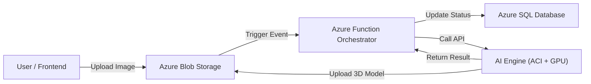

# 👗 TruDrape

**AI-Powered 2D-to-3D Clothing Generation Pipeline**

TruDrape is a cloud-native generative AI system that converts **2D garment images** into **high-fidelity 3D `.glb` assets**.  
It is built to streamline 3D content creation for fashion e-commerce, AR, and virtual try-on experiences.

The system leverages **Hunyuan3D-2.1** for geometry and texture synthesis and is fully orchestrated using **Python** on **Microsoft Azure**.

---

## 🚀 Overview

**Input**
- A single 2D image of a garment (shirt, dress, hoodie, etc.)

**Processing**
- Event-driven orchestration
- GPU-accelerated generative inference

**Output**
- Textured `.glb` 3D model
- Ready for web, AR, or 3D viewers

---

## ✨ Key Features

- **Generative 3D Modeling**  
  Produces realistic meshes and PBR textures using Hunyuan3D Shape + Paint pipelines.

- **Event-Driven Pipeline**  
  Uploading an image automatically triggers the full workflow.

- **Scalable AI Backend**  
  FastAPI-based GPU inference engine.

- **Live Job Tracking**  
  Status lifecycle: `Queued → Processing → Ready`.

- **Cloud-Native Architecture**  
  Designed for Azure Functions, Blob Storage, SQL, and GPU containers.

---

## 🏗️ System Architecture

### High-Level Flow



---

## 🧩 Components

| Component       | Technology                     | Responsibility |
|-----------------|--------------------------------|----------------|
| Frontend        | React / Next.js                | Image upload UI and 3D preview |
| Orchestrator    | Azure Functions (Python)       | Event handling, job coordination |
| AI Engine       | FastAPI + Hunyuan3D-2.1        | 3D generation and texture synthesis |
| Storage         | Azure Blob Storage & Azure SQL | Stores images, models, metadata |

---

## 🛠️ Prerequisites

- **Python** 3.10+
- **Docker**
- **Azure CLI**
- **NVIDIA GPU** (local testing, ≥ 6GB VRAM)
- **Visual Studio Build Tools 2022**
  - C++ Desktop Development (required for rasterizers)

---

## 🧬 AI Engine Setup (Inference Service)

```bash
cd trudrape-ai-engine

# Install dependencies
pip install -r requirements.txt
```

> ⚠️ Ensure C++ rasterizers are compiled according to Hunyuan3D documentation.

```bash
# Download model weights
python download_model.py

# Run FastAPI server
uvicorn main:app --host 0.0.0.0 --port 8001
```

---

## 🧠 Orchestrator Setup (Azure Function)

```bash
cd trudrape-manager
```

1. Configure `local.settings.json`
   - Azure Blob Storage connection string
   - Azure SQL connection string

```bash
# Start function locally
func start
```

---

## 💻 Frontend Setup

```bash
cd frontend
npm install
npm run dev
```

---

## ☁️ Deployment Workflow

1. **Build AI Engine Image**
   - Dockerize FastAPI + Hunyuan3D
   - Push image to Azure Container Registry (ACR)

2. **Deploy GPU Container**
   - Create Azure Container Instance with GPU support

3. **Deploy Orchestrator**
   - Publish Python Azure Function

4. **Connect Services**
   - Set `AI_ENGINE_URL` in Function App settings to ACI endpoint

---

## 📦 API Reference

### `POST /generate`

Generates a 3D model from a provided image URL.

#### Request
```json
{
  "image_url": "https://example.com/image.jpg"
}
```

#### Processing Steps
1. Download image  
2. Generate mesh (Shape pipeline)  
3. Apply textures (Paint pipeline)  
4. Export `.glb`

#### Response
```json
{
  "model_url": "https://example.com/output.glb",
  "status": "success"
}
```

---

## 🤝 Contributing

Contributions are welcome.

- Fork the repository
- Create a feature branch
- Open a pull request

For major changes, please open an issue first.

---

## 📄 License

Specify your license here (e.g., MIT, Apache 2.0).
